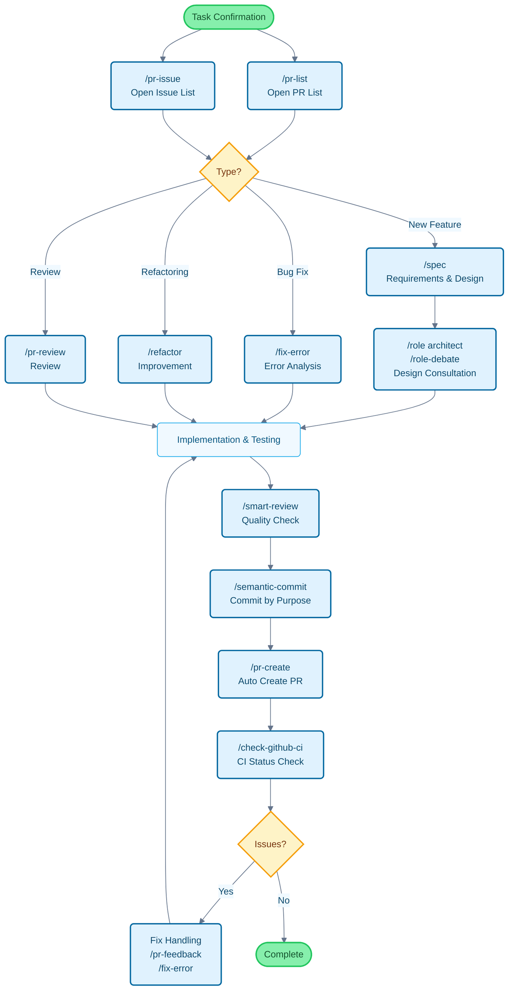

# Claude Code Cookbook

[English](README.md) | [中文](README_zh.md) | [日本語](README_ja.md) | [Français](README_fr.md) | [한국어](README_ko.md)

A configuration collection to make Claude Code more convenient to use.

By automating routine operations, you can focus on what really matters.
Claude Code intelligently handles common tasks like code modifications, test execution, and documentation updates.

## Key Features

Customize Claude Code's behavior through three dimensions:

- **Commands**: Custom commands starting with `/`
- **Roles**: Expert perspectives for specialized answers
- **Hooks**: Automatic script execution at specific timings

---

## Feature List

### Commands (Custom Commands)

Commands are stored as Markdown files in the `/commands` directory. Execute them by typing `/` followed by the filename.

| Command | Description |
| :--- | :--- |
| `/analyze-dependencies` | Analyze project dependencies, visualize circular dependencies and structural issues. |
| `/analyze-performance` | Analyze application performance issues and propose improvements from a technical debt perspective. |
| `/check-fact` | Verify information accuracy by referencing the project codebase and documentation. |
| `/check-github-ci` | Monitor GitHub Actions CI status and track until completion. |
| `/check-prompt` | Review current prompt content and provide improvement suggestions. |
| `/commit-message` | Generate commit messages based on changes. |
| `/context7` | Use Context7 MCP for context management. |
| `/design-patterns` | Propose implementations or review code based on design patterns. |
| `/explain-code` | Clearly explain the functionality and logic of selected code. |
| `/fix-error` | Provide code fixes based on error messages. |
| `/multi-role` | Combine multiple roles to analyze the same target in parallel and generate integrated reports. |
| `/plan` | Activate pre-implementation planning mode to develop detailed implementation strategies. |
| `/pr-auto-update` | Automatically update Pull Request descriptions and labels. |
| `/pr-create` | Achieve efficient Pull Request workflow through automatic PR creation based on Git change analysis. |
| `/pr-feedback` | Efficiently handle Pull Request review comments, solve root causes through three-phase error analysis approach. |
| `/pr-issue` | Display open Issues in the current repository with prioritization. |
| `/pr-list` | Display open PRs in the current repository with prioritization. |
| `/pr-review` | Systematic Pull Request review to ensure code quality and architectural health. |
| `/refactor` | Perform safe, incremental code refactoring and evaluate SOLID principle compliance. |
| `/role-debate` | Have multiple roles debate on specific topics. |
| `/role-help` | Display list and descriptions of available roles. |
| `/role` | Switch to a specified role. |
| `/screenshot` | Capture and analyze screenshots |
| `/search-gemini` | Perform web searches using Gemini. |
| `/semantic-commit` | Split large changes into meaningful minimal units and commit sequentially with semantic commit messages. |
| `/sequential-thinking` | Use Sequential Thinking MCP to analyze complex problems step by step and reach conclusions. |
| `/show-plan` | Display the current execution plan. |
| `/smart-review` | Perform advanced code review to improve code quality. |
| `/spec` | Create detailed specification documents step by step according to Kiro's spec-driven development from requirements. |
| `/style-ai-writting` | Detect and fix unnatural AI-generated text. |
| `/task` | Launch a dedicated agent to autonomously execute complex search, research, and analysis tasks. |
| `/tech-debt` | Analyze project technical debt and create a prioritized improvement plan. |
| `/ultrathink` | Execute phased, structured thinking processes for complex issues or important decisions. |
| `/update-dart-doc` | Systematically manage DartDoc comments in Dart files, maintaining high-quality Japanese documentation. |
| `/update-doc-string` | Uniformly manage and update multi-language documentation strings. |
| `/update-flutter-deps` | Safely update Flutter project dependencies. |
| `/update-node-deps` | Safely update Node.js project dependencies. |
| `/update-rust-deps` | Safely update Rust project dependencies. |

### Roles (Role Settings)

Roles are defined in Markdown files in the `agents/roles/` directory. Give Claude expert perspectives for more accurate answers.

Each role can **run independently as a sub-agent**. Using the `--agent` option allows parallel execution of large-scale analysis or specialized processing without interfering with the main conversation context.

| Role | Description |
| :--- | :--- |
| `/role analyzer` | Act as a systems analysis expert to analyze code and architecture. |
| `/role architect` | Act as a software architect to provide design reviews and suggestions. |
| `/role frontend` | Act as a frontend expert to provide UI/UX and performance advice. |
| `/role mobile` | Act as a mobile app development expert, answering based on iOS/Android best practices. |
| `/role performance` | Act as a performance optimization expert to suggest speed and memory usage improvements. |
| `/role qa` | Act as a QA engineer to review from testing plans and quality assurance perspectives. |
| `/role reviewer` | Act as a code reviewer to evaluate code from readability and maintainability perspectives. |
| `/role security` | Act as a security expert to identify vulnerabilities and security risks. |

#### Sub-agent Execution Examples

```bash
# Regular mode (execute in main context)
/role security
"Check the security of this project"

# Sub-agent mode (execute in independent context)
/role security --agent
"Perform a security audit of the entire project"

# Multi-role parallel analysis
/multi-role security,performance --agent
"Comprehensively analyze system security and performance"
```

### Hooks (Automation Scripts)

Configure in `settings.json` to automate development workflows.

| Script | Event | Description |
| :--- | :--- | :--- |
| `deny-check.sh` | `PreToolUse` | Prevent execution of dangerous commands like `rm -rf /`. |
| `check-ai-commit.sh` | `PreToolUse` | Error if `git commit` message contains AI signature. |
| `preserve-file-permissions.sh` | `PreToolUse` / `PostToolUse` | Save original permissions before editing, restore after. Prevents Claude Code from changing permissions. |
| `ja-space-format.sh` | `PostToolUse` | Automatically format spaces between Japanese and alphanumeric characters when saving files. |
| `auto-comment.sh` | `PostToolUse` | Prompt to add docstrings or API documentation when creating new files or making major edits. |
| `notify-waiting` | `Notification` | Notify through macOS notification center when Claude is waiting for user confirmation. |
| `check-continue.sh` | `Stop` | Check for continuable tasks when a task completes. |
| `(osascript)` | `Stop` | Notify completion through macOS notification center when all tasks complete. |

---

## Development Flow and Command Usage Guide

### Command Application in Typical Development Flow



---

## Installation and Customization

### 🚀 New in v2.0.0: Unified Installer

**One installer, all languages!** We've unified all installation options into a single, intelligent installer.

#### Quick Start (Recommended)
```bash
# Clone repository
git clone https://github.com/foreveryh/claude-code-cookbook.git
cd claude-code-cookbook

# Auto-install with language detection
./install.sh

# Or specify language explicitly
./install.sh --lang en    # English
./install.sh --lang zh    # Chinese
```

#### Installation Steps

1. **Clone repository**: `git clone https://github.com/foreveryh/claude-code-cookbook.git`
2. **Navigate to directory**: `cd claude-code-cookbook`
3. **Run installer**: `./install.sh` (auto-detects language) or `./install.sh --lang <language>`
4. **Configure Claude Desktop**: Set Custom Instructions path to `~/.claude`
5. **Start using**: All commands and roles are now available!

#### Legacy Installation (Manual)

If you prefer manual installation:

##### English Version
1. **Clone repository**: `git clone https://github.com/foreveryh/claude-code-cookbook.git ~/.claude-temp`
2. **Copy English version**: `cp -r ~/.claude-temp/versions/en ~/.claude`
3. **Configure client**: Specify `~/.claude` directory path in Claude Desktop
4. **Verify paths**: Confirm script paths in `settings.json` match your environment
5. **Clean up**: `rm -rf ~/.claude-temp`

##### Japanese Version
1. **Clone repository**: `git clone https://github.com/foreveryh/claude-code-cookbook.git ~/.claude-temp`
2. **Copy Japanese version**: `cp -r ~/.claude-temp/versions/ja ~/.claude`
3. **Configure client**: Specify `~/.claude` directory path in Claude Desktop
4. **Verify paths**: Confirm script paths in `settings.json` match your environment
5. **Clean up**: `rm -rf ~/.claude-temp`

### Customization

- **Add commands**: Simply add `.md` files to `commands/`
- **Add roles**: Simply add `.md` files to `agents/roles/`
- **Edit hooks**: Modify `settings.json` to change automation processes
