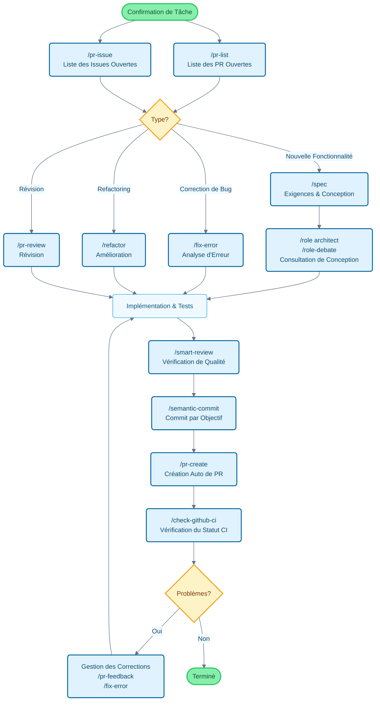

# Claude Code Cookbook

[English](README.md) | [中文](README_zh.md) | [日本語](README_ja.md) | [Français](README_fr.md) | [한국어](README_ko.md)

Une collection de configurations pour rendre Claude Code plus pratique à utiliser.

En automatisant les opérations routinières, vous pouvez vous concentrer sur ce qui compte vraiment.
Claude Code gère intelligemment les tâches courantes comme les modifications de code, l'exécution de tests et les mises à jour de documentation.

## Fonctionnalités Principales

Personnalisez le comportement de Claude Code à travers trois dimensions :

- **Commands** : Commandes personnalisées commençant par `/`
- **Roles** : Perspectives d'experts pour des réponses spécialisées
- **Hooks** : Exécution automatique de scripts à des moments spécifiques

---

## Liste des Fonctionnalités

### Commands (Commandes Personnalisées)

Les commandes sont stockées sous forme de fichiers Markdown dans le répertoire `/commands`. Exécutez-les en tapant `/` suivi du nom du fichier.

| Commande | Description |
| :--- | :--- |
| `/analyze-dependencies` | Analyser les dépendances du projet, visualiser les dépendances circulaires et les problèmes structurels. |
| `/analyze-performance` | Analyser les problèmes de performance de l'application et proposer des améliorations du point de vue de la dette technique. |
| `/check-fact` | Vérifier l'exactitude des informations en référençant le code et la documentation du projet. |
| `/check-github-ci` | Surveiller le statut CI de GitHub Actions et suivre jusqu'à la fin. |
| `/check-prompt` | Examiner le contenu de l'invite actuelle et fournir des suggestions d'amélioration. |
| `/commit-message` | Générer des messages de commit basés sur les modifications. |
| `/context7` | Utiliser Context7 MCP pour la gestion du contexte. |
| `/design-patterns` | Proposer des implémentations ou réviser le code basé sur les design patterns. |
| `/explain-code` | Expliquer clairement la fonctionnalité et la logique du code sélectionné. |
| `/fix-error` | Fournir des corrections de code basées sur les messages d'erreur. |
| `/multi-role` | Combiner plusieurs rôles pour analyser la même cible en parallèle et générer des rapports intégrés. |
| `/plan` | Activer le mode de planification pré-implémentation pour développer des stratégies d'implémentation détaillées. |
| `/pr-auto-update` | Mettre à jour automatiquement les descriptions et étiquettes des Pull Requests. |
| `/pr-create` | Créer automatiquement des PR basées sur l'analyse des changements Git pour un workflow efficace. |
| `/pr-feedback` | Gérer efficacement les commentaires de révision des Pull Requests, résoudre les causes profondes grâce à une approche d'analyse d'erreur en trois phases. |
| `/pr-issue` | Afficher les Issues ouvertes dans le dépôt actuel avec priorisation. |
| `/pr-list` | Afficher les PR ouvertes dans le dépôt actuel avec priorisation. |
| `/pr-review` | Révision systématique des Pull Requests pour assurer la qualité du code et la santé architecturale. |
| `/refactor` | Effectuer un refactoring de code sûr et incrémental et évaluer la conformité aux principes SOLID. |
| `/role-debate` | Faire débattre plusieurs rôles sur des sujets spécifiques. |
| `/role-help` | Afficher la liste et les descriptions des rôles disponibles. |
| `/role` | Basculer vers un rôle spécifié. |
| `/screenshot` | Capturer et analyser des captures d'écran |
| `/search-gemini` | Effectuer des recherches web en utilisant Gemini. |
| `/semantic-commit` | Diviser les grands changements en unités minimales significatives et commiter séquentiellement avec des messages de commit sémantiques. |
| `/sequential-thinking` | Utiliser Sequential Thinking MCP pour analyser les problèmes complexes étape par étape et parvenir à des conclusions. |
| `/show-plan` | Afficher le plan d'exécution actuel. |
| `/smart-review` | Effectuer une révision de code avancée pour améliorer la qualité du code. |
| `/spec` | Créer des documents de spécification détaillés étape par étape selon le développement dirigé par les spécifications de Kiro. |
| `/style-ai-writting` | Détecter et corriger les textes non naturels générés par l'IA. |
| `/task` | Lancer un agent dédié pour exécuter de manière autonome des tâches complexes de recherche et d'analyse. |
| `/tech-debt` | Analyser la dette technique du projet et créer un plan d'amélioration priorisé. |
| `/ultrathink` | Exécuter des processus de pensée structurés et progressifs pour des problèmes complexes ou des décisions importantes. |
| `/update-dart-doc` | Gérer systématiquement les commentaires DartDoc dans les fichiers Dart, maintenir une documentation japonaise de haute qualité. |
| `/update-doc-string` | Gérer et mettre à jour uniformément les chaînes de documentation multilingues. |
| `/update-flutter-deps` | Mettre à jour en toute sécurité les dépendances du projet Flutter. |
| `/update-node-deps` | Mettre à jour en toute sécurité les dépendances du projet Node.js. |
| `/update-rust-deps` | Mettre à jour en toute sécurité les dépendances du projet Rust. |

### Roles (Paramètres de Rôle)

Les rôles sont définis dans des fichiers Markdown dans le répertoire `agents/roles/`. Donnez à Claude des perspectives d'experts pour des réponses plus précises.

Chaque rôle peut **s'exécuter indépendamment en tant que sous-agent**. L'utilisation de l'option `--agent` permet l'exécution parallèle d'analyses à grande échelle ou de traitements spécialisés sans interférer avec le contexte de conversation principal.

| Rôle | Description |
| :--- | :--- |
| `/role analyzer` | Agir en tant qu'expert en analyse de systèmes pour analyser le code et l'architecture. |
| `/role architect` | Agir en tant qu'architecte logiciel pour fournir des révisions et suggestions de conception. |
| `/role frontend` | Agir en tant qu'expert frontend pour fournir des conseils UI/UX et de performance. |
| `/role mobile` | Agir en tant qu'expert en développement d'applications mobiles, répondre selon les meilleures pratiques iOS/Android. |
| `/role performance` | Agir en tant qu'expert en optimisation des performances pour suggérer des améliorations de vitesse et d'utilisation de la mémoire. |
| `/role qa` | Agir en tant qu'ingénieur QA pour réviser du point de vue des plans de test et de l'assurance qualité. |
| `/role reviewer` | Agir en tant que réviseur de code pour évaluer le code du point de vue de la lisibilité et de la maintenabilité. |
| `/role security` | Agir en tant qu'expert en sécurité pour identifier les vulnérabilités et les risques de sécurité. |

#### Exemples d'Exécution de Sous-agent

```bash
# Mode normal (exécuter dans le contexte principal)
/role security
"Vérifier la sécurité de ce projet"

# Mode sous-agent (exécuter dans un contexte indépendant)
/role security --agent
"Effectuer un audit de sécurité de l'ensemble du projet"

# Analyse parallèle multi-rôles
/multi-role security,performance --agent
"Analyser de manière exhaustive la sécurité et les performances du système"
```

### Hooks (Scripts d'Automatisation)

Configurez dans `settings.json` pour automatiser les workflows de développement.

| Script | Événement | Description |
| :--- | :--- | :--- |
| `deny-check.sh` | `PreToolUse` | Empêcher l'exécution de commandes dangereuses comme `rm -rf /`. |
| `check-ai-commit.sh` | `PreToolUse` | Erreur si le message `git commit` contient une signature IA. |
| `preserve-file-permissions.sh` | `PreToolUse` / `PostToolUse` | Sauvegarder les permissions originales avant l'édition, restaurer après. Empêche Claude Code de modifier les permissions. |
| `ja-space-format.sh` | `PostToolUse` | Formater automatiquement les espaces entre les caractères japonais et alphanumériques lors de l'enregistrement des fichiers. |
| `auto-comment.sh` | `PostToolUse` | Demander d'ajouter des docstrings ou de la documentation API lors de la création de nouveaux fichiers ou de modifications majeures. |
| `notify-waiting` | `Notification` | Notifier via le centre de notifications macOS lorsque Claude attend une confirmation de l'utilisateur. |
| `check-continue.sh` | `Stop` | Vérifier les tâches continuables lorsqu'une tâche est terminée. |
| `(osascript)` | `Stop` | Notifier l'achèvement via le centre de notifications macOS lorsque toutes les tâches sont terminées. |

---

## Flux de Développement et Guide d'Utilisation des Commandes

### Application des Commandes dans un Flux de Développement Typique



---

## Installation et Personnalisation

### Étapes d'Installation

1. **Cloner le dépôt** : `git clone https://github.com/wasabeef/claude-code-cookbook.git ~/.claude`
2. **Configurer le client** : Spécifier le chemin du répertoire ci-dessus dans le client Claude
3. **Vérifier les chemins** : Confirmer que les chemins des scripts dans `settings.json` correspondent à votre environnement

### Personnalisation

- **Ajouter des commandes** : Ajoutez simplement des fichiers `.md` dans `commands/`
- **Ajouter des rôles** : Ajoutez simplement des fichiers `.md` dans `agents/roles/`
- **Éditer les hooks** : Modifiez `settings.json` pour changer les processus d'automatisation
