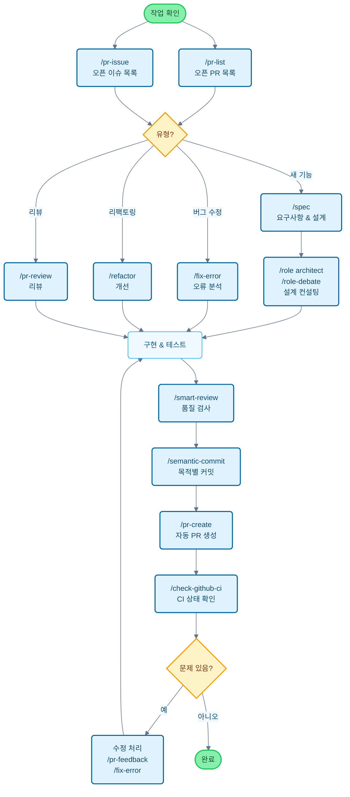

# Claude Code Cookbook

[English](README.md) | [中文](README_zh.md) | [日本語](README_ja.md) | [Français](README_fr.md) | [한국어](README_ko.md)

Claude Code를 더욱 편리하게 사용하기 위한 설정 모음입니다.

루틴한 작업을 자동화하여 정말 중요한 일에 집중할 수 있게 해줍니다.
Claude Code는 코드 수정, 테스트 실행, 문서 업데이트와 같은 일반적인 작업을 지능적으로 처리합니다.

## 주요 기능

세 가지 차원을 통해 Claude Code의 동작을 사용자 정의할 수 있습니다:

- **Commands**: `/`로 시작하는 사용자 정의 명령
- **Roles**: 전문화된 답변을 위한 전문가 관점
- **Hooks**: 특정 시점에 자동으로 스크립트 실행

---

## 기능 목록

### Commands (사용자 정의 명령)

명령은 `/commands` 디렉토리에 Markdown 파일로 저장됩니다. `/`를 입력한 후 파일 이름을 입력하여 실행합니다.

| 명령 | 설명 |
| :--- | :--- |
| `/analyze-dependencies` | 프로젝트 종속성 분석, 순환 종속성 및 구조적 문제 시각화. |
| `/analyze-performance` | 애플리케이션 성능 문제 분석 및 기술 부채 관점에서 개선 사항 제안. |
| `/check-fact` | 프로젝트 코드베이스와 문서를 참조하여 정보의 정확성 검증. |
| `/check-github-ci` | GitHub Actions CI 상태 모니터링 및 완료까지 추적. |
| `/check-prompt` | 현재 프롬프트 내용 검토 및 개선 제안 제공. |
| `/commit-message` | 변경 사항을 기반으로 커밋 메시지 생성. |
| `/context7` | Context7 MCP를 사용한 컨텍스트 관리. |
| `/design-patterns` | 디자인 패턴을 기반으로 구현 제안 또는 코드 검토. |
| `/explain-code` | 선택한 코드의 기능과 로직을 명확하게 설명. |
| `/fix-error` | 오류 메시지를 기반으로 코드 수정 사항 제공. |
| `/multi-role` | 여러 역할을 결합하여 동일한 대상을 병렬 분석하고 통합 보고서 생성. |
| `/plan` | 구현 전 계획 모드를 활성화하여 상세한 구현 전략 개발. |
| `/pr-auto-update` | Pull Request 설명 및 레이블 자동 업데이트. |
| `/pr-create` | Git 변경 분석을 기반으로 자동 PR 생성으로 효율적인 Pull Request 워크플로우 달성. |
| `/pr-feedback` | Pull Request 리뷰 코멘트를 효율적으로 처리, 3단계 오류 분석 접근법으로 근본 원인 해결. |
| `/pr-issue` | 현재 저장소의 열린 이슈를 우선순위와 함께 표시. |
| `/pr-list` | 현재 저장소의 열린 PR을 우선순위와 함께 표시. |
| `/pr-review` | 체계적인 Pull Request 검토로 코드 품질과 아키텍처 건전성 보장. |
| `/refactor` | 안전하고 점진적인 코드 리팩토링 수행 및 SOLID 원칙 준수 평가. |
| `/role-debate` | 여러 역할이 특정 주제에 대해 토론하게 하기. |
| `/role-help` | 사용 가능한 역할 목록과 설명 표시. |
| `/role` | 지정된 역할로 전환. |
| `/screenshot` | 스크린샷 캡처 및 분석 |
| `/search-gemini` | Gemini를 사용한 웹 검색 수행. |
| `/semantic-commit` | 큰 변경 사항을 의미 있는 최소 단위로 분할하고 시맨틱 커밋 메시지로 순차적으로 커밋. |
| `/sequential-thinking` | Sequential Thinking MCP를 사용하여 복잡한 문제를 단계별로 분석하고 결론 도출. |
| `/show-plan` | 현재 실행 계획 표시. |
| `/smart-review` | 고급 코드 리뷰를 수행하여 코드 품질 향상. |
| `/spec` | 요구사항으로부터 Kiro의 사양 중심 개발에 따라 상세한 사양 문서를 단계별로 생성. |
| `/style-ai-writting` | AI가 생성한 부자연스러운 텍스트 감지 및 수정. |
| `/task` | 복잡한 검색, 연구 및 분석 작업을 자율적으로 실행하는 전용 에이전트 시작. |
| `/tech-debt` | 프로젝트 기술 부채 분석 및 우선순위가 지정된 개선 계획 생성. |
| `/ultrathink` | 복잡한 문제나 중요한 결정에 대한 단계적이고 구조화된 사고 프로세스 실행. |
| `/update-dart-doc` | Dart 파일의 DartDoc 주석을 체계적으로 관리, 고품질 일본어 문서 유지. |
| `/update-doc-string` | 다국어 문서 문자열을 균일하게 관리 및 업데이트. |
| `/update-flutter-deps` | Flutter 프로젝트 종속성을 안전하게 업데이트. |
| `/update-node-deps` | Node.js 프로젝트 종속성을 안전하게 업데이트. |
| `/update-rust-deps` | Rust 프로젝트 종속성을 안전하게 업데이트. |

### Roles (역할 설정)

역할은 `agents/roles/` 디렉토리의 Markdown 파일에 정의됩니다. Claude에게 전문가 관점을 제공하여 더 정확한 답변을 얻을 수 있습니다.

각 역할은 **서브 에이전트로 독립적으로 실행**할 수 있습니다. `--agent` 옵션을 사용하면 메인 대화 컨텍스트를 방해하지 않고 대규모 분석이나 전문적인 처리를 병렬로 실행할 수 있습니다.

| 역할 | 설명 |
| :--- | :--- |
| `/role analyzer` | 시스템 분석 전문가로서 코드와 아키텍처 분석. |
| `/role architect` | 소프트웨어 아키텍트로서 설계 검토 및 제안 제공. |
| `/role frontend` | 프론트엔드 전문가로서 UI/UX 및 성능 조언 제공. |
| `/role mobile` | 모바일 앱 개발 전문가로서 iOS/Android 모범 사례를 기반으로 답변. |
| `/role performance` | 성능 최적화 전문가로서 속도 및 메모리 사용 개선 제안. |
| `/role qa` | QA 엔지니어로서 테스트 계획 및 품질 보증 관점에서 검토. |
| `/role reviewer` | 코드 리뷰어로서 가독성 및 유지보수성 관점에서 코드 평가. |
| `/role security` | 보안 전문가로서 취약점 및 보안 위험 식별. |

#### 서브 에이전트 실행 예제

```bash
# 일반 모드 (메인 컨텍스트에서 실행)
/role security
"이 프로젝트의 보안 확인"

# 서브 에이전트 모드 (독립 컨텍스트에서 실행)
/role security --agent
"전체 프로젝트의 보안 감사 수행"

# 다중 역할 병렬 분석
/multi-role security,performance --agent
"시스템 보안 및 성능을 포괄적으로 분석"
```

### Hooks (자동화 스크립트)

`settings.json`에서 구성하여 개발 워크플로우를 자동화합니다.

| 스크립트 | 이벤트 | 설명 |
| :--- | :--- | :--- |
| `deny-check.sh` | `PreToolUse` | `rm -rf /`와 같은 위험한 명령 실행 방지. |
| `check-ai-commit.sh` | `PreToolUse` | `git commit` 메시지에 AI 서명이 포함된 경우 오류 발생. |
| `preserve-file-permissions.sh` | `PreToolUse` / `PostToolUse` | 편집 전 원본 권한 저장, 편집 후 복원. Claude Code가 권한을 변경하는 것 방지. |
| `ja-space-format.sh` | `PostToolUse` | 파일 저장 시 일본어와 영숫자 사이의 공백 자동 포맷. |
| `auto-comment.sh` | `PostToolUse` | 새 파일 생성 또는 주요 편집 시 docstring 또는 API 문서 추가 요청. |
| `notify-waiting` | `Notification` | Claude가 사용자 확인을 기다릴 때 macOS 알림 센터를 통해 알림. |
| `check-continue.sh` | `Stop` | 작업 완료 시 계속 가능한 작업 확인. |
| `(osascript)` | `Stop` | 모든 작업 완료 시 macOS 알림 센터를 통해 완료 알림. |

---

## 개발 플로우 및 명령 사용 가이드

### 일반적인 개발 플로우에서의 명령 적용



---

## 설치 및 사용자 정의

### 설치 단계

1. **저장소 클론**: `git clone https://github.com/foreveryh/claude-code-cookbook.git ~/.claude`
2. **클라이언트 구성**: Claude 클라이언트에서 위 디렉토리 경로 지정
3. **경로 확인**: `settings.json`의 스크립트 경로가 환경과 일치하는지 확인

### 사용자 정의

- **명령 추가**: `commands/`에 `.md` 파일을 추가하기만 하면 됩니다
- **역할 추가**: `agents/roles/`에 `.md` 파일을 추가하기만 하면 됩니다
- **Hooks 편집**: `settings.json`을 수정하여 자동화 프로세스 변경
