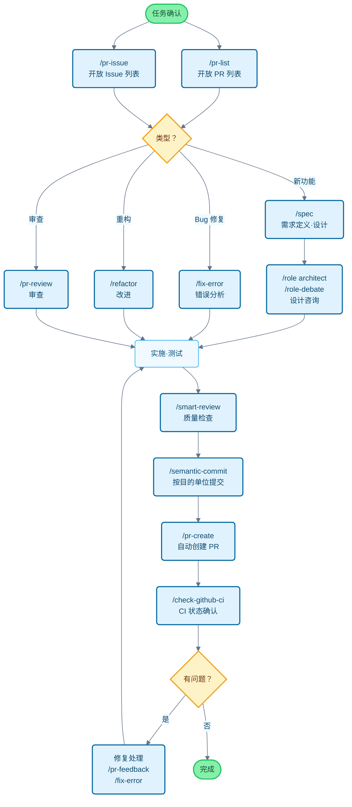

# Claude Code Cookbook 🎉 中文版

[English](README.md) | **[中文](README_zh.md)** ✅ | [日本語](README_ja.md) | [Français](README_fr.md) | [한국어](README_ko.md)

让 Claude Code 使用更便捷的配置集合。

通过自动化执行常规操作，让您专注于真正重要的工作。
Claude Code 会智能判断并执行代码修改、测试运行、文档更新等常见任务。

## 🎯 中文版特色

- 📝 **完整本地化**: 所有命令、角色和文档均已中文化
- 🤖 **智能语言识别**: 自动检测项目语言，生成对应语言的提交消息
- 🌐 **中文优化**: 专为中文项目优化的提示词和输出格式
- 🚀 **一键安装**: 简单的安装脚本，快速开始使用
- 📚 **详尽文档**: 提供完整的中文使用说明和最佳实践

## 主要功能

通过三种方式自定义 Claude Code 的行为：

- **Commands（命令）**：以 `/` 开头的自定义命令
- **Roles（角色）**：让 Claude 以专家视角回答问题
- **Hooks（钩子）**：在特定时机自动执行脚本

---

## 功能列表

### Commands（自定义命令）

命令存储在 `/commands` 目录的 Markdown 文件中。输入 `/` 加文件名即可执行。

| 命令 | 描述 |
| :--- | :--- |
| `/analyze-dependencies` | 分析项目依赖关系，可视化循环依赖和结构问题。 |
| `/analyze-performance` | 分析应用性能问题，从技术债务角度提出改进建议。 |
| `/check-fact` | 参考项目代码库和文档，验证信息的准确性。 |
| `/check-github-ci` | 监控 GitHub Actions CI 状态，跟踪至完成。 |
| `/check-prompt` | 审查当前提示词内容，提供改进建议。 |
| `/commit-message` | 基于变更内容生成提交信息。 |
| `/context7` | 使用 Context7 MCP 进行上下文管理。 |
| `/design-patterns` | 基于设计模式提出实现方案或进行代码审查。 |
| `/explain-code` | 清晰解释所选代码的功能和逻辑。 |
| `/fix-error` | 根据错误信息提供代码修复方案。 |
| `/multi-role` | 组合多个角色，并行分析同一目标并生成综合报告。 |
| `/plan` | 启动实施前规划模式，制定详细的实施策略。 |
| `/pr-auto-update` | 自动更新 Pull Request 的描述和标签。 |
| `/pr-create` | 基于 Git 变更分析自动创建 PR，优化 Pull Request 工作流。 |
| `/pr-feedback` | 高效处理 Pull Request 审查意见，通过三阶段错误分析方法解决根本问题。 |
| `/pr-issue` | 显示当前仓库的开放 Issue 列表（按优先级排序）。 |
| `/pr-list` | 显示当前仓库的开放 PR 列表（按优先级排序）。 |
| `/pr-review` | 系统化审查 Pull Request，确保代码质量和架构健康。 |
| `/refactor` | 执行安全的渐进式代码重构，评估 SOLID 原则的遵循情况。 |
| `/role-debate` | 让多个角色就特定主题进行辩论。 |
| `/role-help` | 显示可用角色的列表和说明。 |
| `/role` | 切换到指定角色。 |
| `/screenshot` | 捕获并分析屏幕截图 |
| `/search-gemini` | 使用 Gemini 进行网络搜索。 |
| `/semantic-commit` | 将大型变更拆分为有意义的最小单元，使用语义化提交信息逐步提交。 |
| `/sequential-thinking` | 使用 Sequential Thinking MCP 逐步分析复杂问题，得出结论。 |
| `/show-plan` | 显示当前执行计划。 |
| `/smart-review` | 执行高级代码审查，提升代码质量。 |
| `/spec` | 根据需求，按照 Kiro 的规范驱动开发方法逐步创建详细规格文档。 |
| `/style-ai-writting` | 检测并修正 AI 生成的不自然文本。 |
| `/task` | 启动专用代理，自主执行复杂的搜索、调研和分析任务。 |
| `/tech-debt` | 分析项目技术债务，创建优先级改进计划。 |
| `/ultrathink` | 对复杂问题或重要决策执行分阶段的结构化思考过程。 |
| `/update-dart-doc` | 系统管理 Dart 文件的 DartDoc 注释，维护高质量的日语文档。 |
| `/update-doc-string` | 统一管理和更新多语言文档字符串。 |
| `/update-flutter-deps` | 安全更新 Flutter 项目依赖。 |
| `/update-node-deps` | 安全更新 Node.js 项目依赖。 |
| `/update-rust-deps` | 安全更新 Rust 项目依赖。 |

### Roles（角色设置）

角色定义在 `agents/roles/` 目录的 Markdown 文件中。让 Claude 具备专家视角，提供更精准的答案。

每个角色都可以**作为子代理独立运行**。使用 `--agent` 选项可以在不干扰主对话上下文的情况下，并行执行大规模分析或专业处理。

| 角色 | 描述 |
| :--- | :--- |
| `/role analyzer` | 作为系统分析专家，分析代码和架构。 |
| `/role architect` | 作为软件架构师，提供设计审查和建议。 |
| `/role frontend` | 作为前端专家，提供 UI/UX 和性能建议。 |
| `/role mobile` | 作为移动应用开发专家，基于 iOS/Android 最佳实践回答问题。 |
| `/role performance` | 作为性能优化专家，提出速度和内存使用改进建议。 |
| `/role qa` | 作为 QA 工程师，从测试计划和质量保证角度进行审查。 |
| `/role reviewer` | 作为代码审查员，从可读性和可维护性角度评估代码。 |
| `/role security` | 作为安全专家，指出漏洞和安全风险。 |

#### 子代理执行示例

```bash
# 常规模式（在主上下文中执行）
/role security
"检查这个项目的安全性"

# 子代理模式（在独立上下文中执行）
/role security --agent
"执行整个项目的安全审计"

# 多角色并行分析
/multi-role security,performance --agent
"全面分析系统的安全性和性能"
```

### Hooks（自动化脚本）

在 `settings.json` 中配置，自动化开发工作流。

| 执行脚本 | 事件 | 描述 |
| :--- | :--- | :--- |
| `deny-check.sh` | `PreToolUse` | 阻止执行危险命令（如 `rm -rf /`）。 |
| `check-ai-commit.sh` | `PreToolUse` | 检查 `git commit` 消息中是否包含 AI 签名，如有则报错。 |
| `preserve-file-permissions.sh` | `PreToolUse` / `PostToolUse` | 在编辑前保存原始权限，编辑后恢复。防止 Claude Code 更改权限。 |
| `ja-space-format.sh` | `PostToolUse` | 保存文件时自动格式化日文和英数字之间的空格。 |
| `auto-comment.sh` | `PostToolUse` | 创建新文件或大幅编辑时，提示添加 docstring 或 API 文档。 |
| `notify-waiting` | `Notification` | Claude 等待用户确认时，通过 macOS 通知中心提醒。 |
| `check-continue.sh` | `Stop` | 任务完成时，检查是否有可继续的任务。 |
| `(osascript)` | `Stop` | 所有任务完成时，通过 macOS 通知中心通知完成。 |

---

## 开发流程和命令使用指南

### 典型开发流程中的命令应用



---

## 安装和自定义

### 安装步骤

### 🚀 v2.0.0 新功能：统一安装程序

**一个安装程序，支持所有语言！** 我们将所有安装选项统一到单个智能安装程序中。

#### 快速开始（推荐）🚀
```bash
# 克隆仓库
git clone https://github.com/foreveryh/claude-code-cookbook.git
cd claude-code-cookbook

# 自动安装（智能语言检测）
./install.sh

# 或者明确指定语言
./install.sh --lang zh    # 中文版
./install.sh --lang en    # 英文版
```

#### 安装步骤

1. **克隆仓库**：`git clone https://github.com/foreveryh/claude-code-cookbook.git`
2. **进入目录**：`cd claude-code-cookbook`
3. **运行安装程序**：`./install.sh`（自动检测语言）或 `./install.sh --lang <语言>`
4. **配置 Claude Desktop**：设置自定义指令路径为 `~/.claude`
5. **开始使用**：所有命令和角色现在都可用了！

#### 传统安装选项

##### 选项 1：一键安装中文版
```bash
# 明确指定中文版
./install.sh --lang zh
```

#### 选项 2：手动安装中文版
1. **克隆仓库**：`git clone https://github.com/foreveryh/claude-code-cookbook.git ~/.claude-temp`
2. **复制中文版**：`cp -r ~/.claude-temp/versions/zh ~/.claude`
3. **配置客户端**：在 Claude Desktop 中指定 `~/.claude` 目录路径
4. **验证路径**：确认 `settings.json` 中的脚本路径与您的环境匹配
5. **清理临时文件**：`rm -rf ~/.claude-temp`

#### 选项 3：安装其他语言版本

**英文版**：
```bash
git clone https://github.com/foreveryh/claude-code-cookbook.git
cd claude-code-cookbook
./install.sh --lang en
```

**日文版**：
```bash
git clone https://github.com/foreveryh/claude-code-cookbook.git
cd claude-code-cookbook
./install.sh --lang ja
```

**法文版**：
```bash
git clone https://github.com/foreveryh/claude-code-cookbook.git
cd claude-code-cookbook
./install.sh --lang fr
```

**韩文版**：
```bash
git clone https://github.com/foreveryh/claude-code-cookbook.git
cd claude-code-cookbook
./install.sh --lang ko
```

### 自定义配置

- **添加命令**：在 `commands/` 目录添加 `.md` 文件
- **添加角色**：在 `agents/roles/` 目录添加 `.md` 文件
- **编辑 Hooks**：修改 `settings.json` 来更改自动化处理

