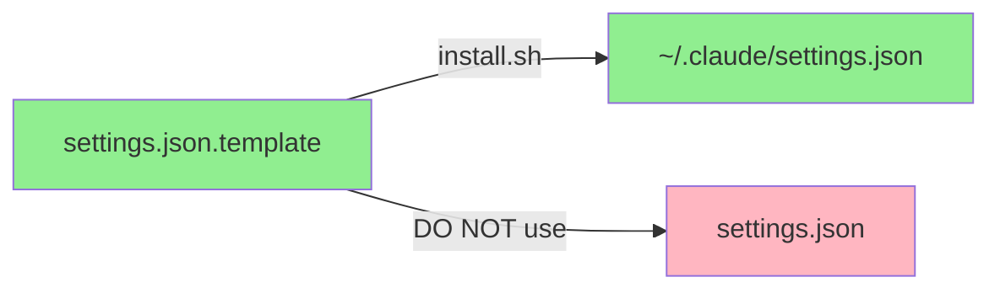

# Settings Configuration Guide / 配置文件说明

## ⚠️ IMPORTANT / 重要说明

### File Purpose / 文件用途

| File / 文件 | Purpose / 用途 | Should Edit? / 是否应编辑 |
|------------|---------------|-------------------------|
| `settings.json.template` | Master template / 主模板 | ✅ YES - Edit this for defaults / 编辑此文件设置默认值 |
| `settings.json.example` | Reference only / 仅供参考 | ❌ NO - Example only / 仅作示例 |
| `settings.json` | Generated file / 生成的文件 | ❌ NO - Auto-generated / 自动生成 |
| `~/.claude/settings.json` | Your config / 你的配置 | ✅ YES - Edit for local changes / 编辑此文件进行本地修改 |

## How It Works / 工作原理



## For Developers / 开发者指南

### Adding New Features / 添加新功能

1. **Edit the template / 编辑模板**
   ```bash
   vim settings.json.template
   ```

2. **Test installation / 测试安装**
   ```bash
   ./install.sh --lang en --target ./test
   ```

3. **Commit template only / 仅提交模板**
   ```bash
   git add settings.json.template
   git commit -m "Add new feature to settings"
   ```

### Common Mistakes / 常见错误

❌ **WRONG / 错误**
```bash
# Editing the generated file
vim settings.json
git add settings.json  # This file should NOT be committed
```

✅ **CORRECT / 正确**
```bash
# Edit the template
vim settings.json.template
git add settings.json.template
```

## For Users / 用户指南

### Installing / 安装

```bash
# Run installer - it will generate settings.json from template
./install.sh --lang zh
```

### Customizing / 自定义

```bash
# Edit your local settings (after installation)
vim ~/.claude/settings.json
```

### Updating / 更新

```bash
# Pull latest changes
git pull

# Re-run installer to get new template features
./install.sh --lang zh
```

## Why This Design? / 为什么这样设计？

1. **Single source of truth / 单一事实来源**
   - Template is the master copy / 模板是主副本
   - No duplicate maintenance / 无需重复维护

2. **Language flexibility / 语言灵活性**
   - Template supports placeholders / 模板支持占位符
   - Different languages get different values / 不同语言获得不同值

3. **Clean version control / 清晰的版本控制**
   - Only template is committed / 仅提交模板
   - No merge conflicts from generated files / 无生成文件的合并冲突

## Quick Reference / 快速参考

```bash
# Check what will be installed
cat settings.json.template

# Check what was installed
cat ~/.claude/settings.json

# See an example (for reference only)
cat settings.json.example

# DO NOT edit or commit this
# 不要编辑或提交这个文件
cat settings.json  # ❌ IGNORED by git
```
