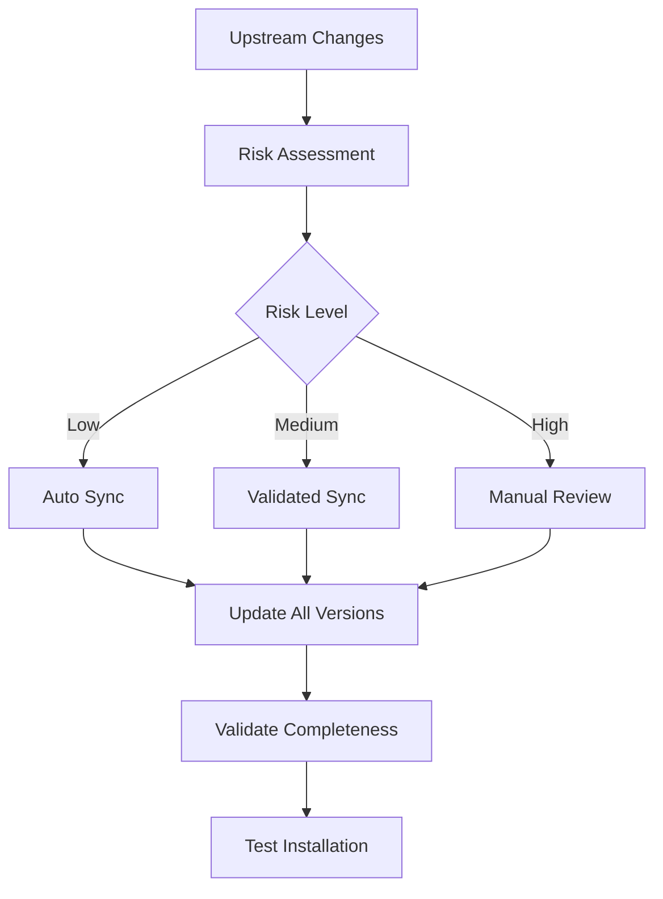

# Architecture Overview

> **Navigation:** [Previous: Basic Usage](03-basic-usage.md) | [Next: Maintenance Tools](05-maintenance-tools.md) | [Documentation Index](README.md)

## Quick Reference

```bash
# Explore the architecture
ls versions/                    # See language versions
ls versions/en/                # English version structure
tree ~/.claude/                # Installed structure (if tree is available)

# Architecture validation
./utils/workflow-manager.sh status    # Check system health
python3 utils/translate-content.py validate  # Verify completeness
```

## Overview

Claude Code Cookbook uses a sophisticated architecture that provides superior organization, maintainability, and multi-language support compared to the original upstream project. This guide explains the key architectural decisions and their benefits.

## Core Architecture Principles

### 1. Versions-First Design
Unlike the upstream's `locales/` approach, we use a `versions/` structure that treats each language as a complete, first-class system.

### 2. Complete Language Parity
Every language version contains identical functionality, ensuring no user is left with a subset of features.

### 3. Intelligent Synchronization
Advanced tooling maintains upstream compatibility while preserving architectural advantages.

### 4. Safety-First Updates
Multiple layers of validation and backup ensure safe evolution of the system.

## Directory Structure

### Project Root
```
claude-code-cookbook/
├── 📁 versions/              # 🌟 Core advantage: Complete language versions
├── 📁 utils/                 # 🔧 Maintenance and automation tools
├── 📁 scripts/               # 📜 Root-level scripts (English baseline)
├── 📁 commands/              # 📋 Root-level commands (English baseline)
├── 📁 agents/                # 🤖 Root-level agents (English baseline)
├── 📁 docs/                  # 📚 Documentation system
├── 🔧 install.sh             # 🚀 Intelligent installer
├── 🔧 daily-maintenance.sh   # 📅 Quick maintenance
└── 📄 README.md              # 📖 Project introduction
```

### Versions Structure (Our Key Advantage)
```
versions/
├── en/                       # English (complete reference)
│   ├── commands/             # 42+ command files
│   ├── agents/roles/         # 8 expert roles
│   ├── scripts/              # 9 automation scripts
│   ├── hooks/                # Workflow automation
│   ├── Claude.md             # Main instructions
│   └── .mcp.json             # MCP configuration
├── zh/                       # Chinese (complete mirror)
├── ja/                       # Japanese (complete mirror)
├── fr/                       # French (expanding)
└── ko/                       # Korean (expanding)
```

### Installed Structure (~/.claude/)
```
~/.claude/
├── commands/                 # Active command set
├── agents/roles/             # Active role definitions
├── scripts/                  # Active automation scripts
├── hooks/                    # Active workflow hooks
├── settings.json             # Generated configuration
├── Claude.md                 # Language-specific instructions
└── .env                      # Environment variables
```

## Architectural Advantages

### 1. Superior Organization vs Upstream

| Aspect | Upstream (locales/) | Our System (versions/) |
|--------|-------------------|----------------------|
| **Structure** | Scattered across locales/ | Centralized in versions/ |
| **Completeness** | Partial language support | Complete language parity |
| **Maintenance** | Complex multi-location edits | Single-location updates |
| **Installation** | Complex path resolution | Simple language selection |
| **Validation** | Manual checking required | Automated completeness verification |

### 2. Complete Language Parity

Every language version contains:
- ✅ **All 42+ commands** with proper translations
- ✅ **All 8 expert roles** with cultural adaptations
- ✅ **All 9 scripts** with localized messages
- ✅ **Complete hook system** with language-specific behaviors
- ✅ **Identical functionality** regardless of language choice

### 3. Intelligent Installation System

```bash
# The installer intelligently:
./install.sh --lang zh

# 1. Selects complete zh/ version
# 2. Copies all components to ~/.claude/
# 3. Generates language-specific settings.json
# 4. Configures localized notifications
# 5. Validates installation completeness
```

## Component Architecture

### 1. Command System

#### Command Structure
```markdown
# Each command file contains:
## Command Description     # What it does
## Usage Examples         # How to use it
## Parameters             # Available options
## Integration Notes       # Works with other commands
## Troubleshooting        # Common issues
```

#### Command Categories
- **Code Analysis**: explain-code, analyze-dependencies, check-fact
- **Development**: refactor, fix-error, design-patterns
- **Git/PR Management**: pr-create-smart, semantic-commit, pr-review
- **Documentation**: update-doc-string, update-dart-doc
- **Project Management**: plan, task, spec

### 2. Role System

#### Role Architecture
```markdown
# Each role defines:
## Expert Identity        # Who the expert is
## Core Competencies     # What they specialize in
## Communication Style   # How they respond
## Knowledge Domains     # Areas of expertise
## Interaction Patterns  # How they engage
```

#### Role Categories
- **Technical**: architect, performance, security
- **Process**: reviewer, qa
- **Domain-Specific**: frontend, mobile

### 3. Hook System

#### Hook Types
```json
{
  "PreToolUse": [     // Before Claude executes tools
    "Security validation",
    "Permission checking"
  ],
  "PostToolUse": [    // After Claude executes tools
    "Auto-formatting",
    "Notification sending"
  ],
  "UserPromptSubmit": [ // When user submits prompts
    "Context enhancement"
  ]
}
```

#### Hook Benefits
- **Automated Workflows**: Reduce manual tasks
- **Quality Assurance**: Automatic validation
- **User Experience**: Seamless notifications
- **Safety**: Pre-execution validation

## Synchronization Architecture

### 1. Upstream Compatibility Layer

```bash
# Our sync system maps:
upstream/locales/en/commands/  →  our/versions/en/commands/
upstream/locales/zh/commands/  →  our/versions/zh/commands/
upstream/scripts/              →  our/scripts/ + all versions/*/scripts/
```

### 2. Intelligent Sync Process



### 3. Safety Mechanisms

#### Backup System
- **Git Tags**: Automatic backup points
- **Installation Backup**: ~/.claude_backup_TIMESTAMP/
- **Rollback Capability**: One-command restoration

#### Validation System
- **Syntax Checking**: JSON and Markdown validation
- **Completeness Verification**: All languages have all components
- **Installation Testing**: Dry-run validation
- **Cross-Reference Checking**: Internal link validation

## Maintenance Tool Architecture

### 1. Tool Hierarchy

```
utils/
├── workflow-manager.sh       # 🎛️ Unified orchestration
├── sync-upstream.sh          # 🔄 Upstream synchronization
├── translate-content.py      # 🌍 Translation management
├── release-manager.sh        # 🚀 Version control
├── auto-maintenance.sh       # 🤖 Automated maintenance
└── cleanup-structure.sh      # 🧹 Structure optimization
```

### 2. Tool Integration

```bash
# Tools work together seamlessly:
workflow-manager.sh           # Orchestrates other tools
├── calls sync-upstream.sh    # For upstream updates
├── calls translate-content.py # For translation validation
├── calls release-manager.sh  # For version management
└── calls cleanup-structure.sh # For structure optimization
```

### 3. Automation Layers

#### Level 1: Manual Control
```bash
./utils/sync-upstream.sh sync --dry-run  # Preview changes
./utils/workflow-manager.sh interactive  # Guided workflows
```

#### Level 2: Semi-Automated
```bash
./daily-maintenance.sh                   # Interactive maintenance
./utils/auto-maintenance.sh check       # Risk assessment
```

#### Level 3: Full Automation
```bash
./utils/auto-maintenance.sh             # Intelligent auto-sync
# + cron job for scheduled maintenance
```

## Configuration Architecture

### 1. Settings Generation

The installer generates optimized `settings.json` based on:
- **Language Selection**: Localized notifications and messages
- **Performance Tuning**: Optimized hook timing
- **Security Configuration**: Safe command restrictions
- **Integration Setup**: MCP and external tool configuration

### 2. Environment Management

```bash
# .env file contains:
CLAUDE_LANGUAGE=en              # UI language
PPINFRA_API_KEY=...            # AI model configuration
GEMINI_API_KEY=...             # Alternative model
DEFAULT_MODEL=ppinfra          # Model selection
```

### 3. Hook Configuration

```json
{
  "hooks": {
    "PreToolUse": [
      {
        "matcher": "Bash(git commit*)",
        "hooks": [{"command": "check-ai-commit.sh"}]
      }
    ],
    "PostToolUse": [
      {
        "matcher": "Edit|Write",
        "hooks": [{"command": "auto-comment.sh"}]
      }
    ]
  }
}
```

## Performance Architecture

### 1. Optimization Strategies

#### Lazy Loading
- Commands loaded on-demand
- Roles activated when needed
- Scripts cached for performance

#### Intelligent Caching
- Translation cache for faster updates
- Upstream change detection
- Validation result caching

#### Parallel Processing
- Multi-language updates in parallel
- Concurrent validation checks
- Asynchronous notifications

### 2. Resource Management

#### Memory Efficiency
- Minimal runtime footprint
- Efficient file organization
- Smart garbage collection

#### Disk Usage
- Compressed archives for releases
- Automatic cleanup of old backups
- Efficient storage of translations

## Security Architecture

### 1. Permission System

```json
{
  "permissions": {
    "allow": [
      "Bash(*)",           // General bash access
      "Edit(**)",          // File editing
      "Read(**)"           // File reading
    ],
    "deny": [
      "Bash(rm -rf /)",    // Dangerous commands
      "Bash(sudo*)",       // Privilege escalation
      "Bash(format*)"      // Destructive operations
    ]
  }
}
```

### 2. Validation Layers

#### Input Validation
- Command parameter checking
- File path sanitization
- Script execution validation

#### Output Validation
- Generated file verification
- Installation completeness checking
- Configuration syntax validation

## Extensibility Architecture

### 1. Plugin System

#### Adding New Commands
```bash
# 1. Create command file
echo "# New Command" > versions/en/commands/new-command.md

# 2. Translate to other languages
python3 utils/translate-content.py translate --lang zh

# 3. Validate completeness
python3 utils/translate-content.py validate
```

#### Adding New Roles
```bash
# 1. Create role definition
echo "# New Role" > versions/en/agents/roles/new-role.md

# 2. Sync to all languages
./utils/workflow-manager.sh sync
```

### 2. Integration Points

#### External Tools
- MCP server integration
- AI model switching
- Custom hook development

#### Workflow Integration
- CI/CD pipeline hooks
- Git workflow integration
- IDE plugin compatibility

## Future Architecture Considerations

### 1. Scalability
- Support for additional languages
- Modular component system
- Distributed maintenance

### 2. Performance
- Advanced caching strategies
- Incremental updates
- Parallel processing improvements

### 3. Integration
- Enhanced IDE integration
- Cloud synchronization
- Team collaboration features

## Next Steps

### For Developers
1. **[Maintenance Tools](05-maintenance-tools.md)** - Learn the automation system
2. **[Advanced Configuration](90-advanced-configuration.md)** - Customize the architecture
3. **[Contributing](91-contributing.md)** - Extend the system

### For Maintainers
1. **[Upstream Sync Guide](06-sync-upstream-guide.md)** - Keep synchronized
2. **[Translation Management](07-translation-management.md)** - Manage languages
3. **[Workflow Automation](09-workflow-automation.md)** - Automate maintenance

---

**Ready to learn the maintenance tools?** Continue to **[Maintenance Tools Overview](05-maintenance-tools.md)** to understand the automation system.

> **Navigation:** [Previous: Basic Usage](03-basic-usage.md) | [Next: Maintenance Tools](05-maintenance-tools.md) | [Documentation Index](README.md)