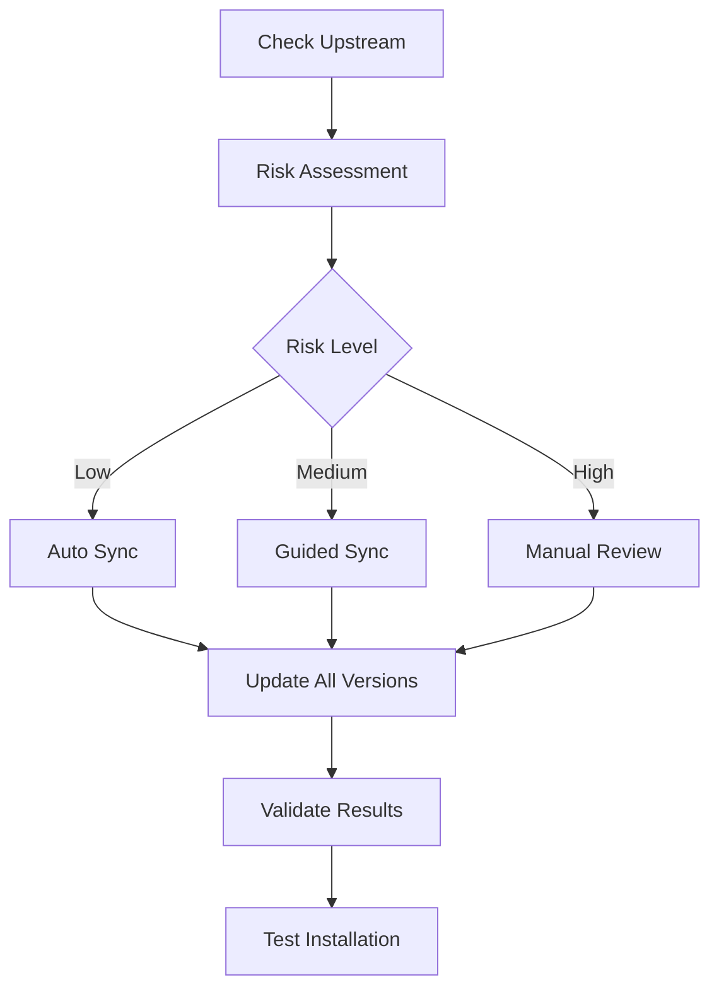

# Upstream Synchronization Guide

> **Navigation:** [Previous: Maintenance Tools](05-maintenance-tools.md) | [Next: Translation Management](07-translation-management.md) | [Documentation Index](README.md)

## Quick Reference

```bash
# 🔍 Check for Updates
./utils/sync-upstream.sh check

# 🔄 Full Synchronization  
./utils/workflow-manager.sh sync

# 🎛️ Interactive Management
./utils/workflow-manager.sh interactive

# 📊 View Status
./utils/workflow-manager.sh status
```

## Overview

This guide covers synchronizing your Claude Code Cookbook installation with the upstream repository (wasabeef/claude-code-cookbook) while preserving your superior `versions/` architecture and advanced features.

## Understanding Upstream Sync

### What Gets Synchronized

#### From Upstream to Your Project
- **New Commands**: Latest command additions and improvements
- **Script Updates**: Performance improvements and bug fixes  
- **Role Enhancements**: Updated expert role definitions
- **Documentation**: README and installation guide updates
- **Configuration**: Settings template improvements

#### What Stays Yours
- **Architecture**: Your superior `versions/` structure
- **Advanced Features**: Commands like `/pr-create-smart`, `/deploy-check`
- **Automation Tools**: Your maintenance and sync tools
- **Complete Language Parity**: All languages stay synchronized

### Sync Process Overview



## Sync Methods

### Method 1: Simple Daily Check (Recommended for Beginners)

```bash
# Run the friendly daily maintenance
./daily-maintenance.sh

# This provides an interactive menu:
# 1. 🚀 Sync immediately (if updates found)
# 2. 🔍 Preview sync content  
# 3. 📊 View project status
# 4. ❌ Skip for now
```

**Best for**: New users, weekly maintenance, safe defaults

### Method 2: Workflow Manager (Recommended for Regular Use)

```bash
# Interactive mode with full control
./utils/workflow-manager.sh interactive

# Or direct commands
./utils/workflow-manager.sh sync          # Full sync workflow
./utils/workflow-manager.sh sync --dry-run  # Preview mode
./utils/workflow-manager.sh status       # Current status
```

**Best for**: Regular users, monthly maintenance, balanced control

### Method 3: Direct Sync Tool (For Advanced Users)

```bash
# Check what's available
./utils/sync-upstream.sh check

# Preview changes
./utils/sync-upstream.sh sync --dry-run

# Execute sync
./utils/sync-upstream.sh sync

# Sync specific language only
./utils/sync-upstream.sh sync --lang zh
```

**Best for**: Advanced users, custom workflows, specific needs

### Method 4: Automated Sync (For Power Users)

```bash
# Intelligent automated sync
./utils/auto-maintenance.sh

# Check only (no changes)
./utils/auto-maintenance.sh check

# Force sync (override safety checks)
./utils/auto-maintenance.sh force --dry-run
```

**Best for**: Automation, production systems, hands-off maintenance

## Step-by-Step Sync Process

### Step 1: Pre-Sync Preparation

#### Check Current Status
```bash
# Verify your project is healthy
./utils/workflow-manager.sh status

# Check for uncommitted changes
git status

# Ensure tools are working
ls -la utils/*.sh utils/*.py
```

#### Create Backup (Recommended)
```bash
# Automatic backup (done by tools)
# Manual backup if desired
git tag manual-backup-$(date +%Y%m%d) -m "Manual backup before sync"
```

### Step 2: Check Upstream Changes

```bash
# Method 1: Simple check
./daily-maintenance.sh

# Method 2: Detailed check  
./utils/sync-upstream.sh check

# Method 3: Full status
./utils/workflow-manager.sh status
```

#### Understanding the Output
```bash
# Example output:
[INFO] Found 15 new commits from upstream
[INFO] Recent upstream changes:
abc1234 feat: add new security analysis command
def5678 fix: improve statusline performance  
ghi9012 docs: update installation instructions
```

### Step 3: Risk Assessment

The tools automatically assess risk levels:

#### 🟢 **Low Risk** (Safe for auto-sync)
- Documentation updates
- Minor bug fixes
- Small improvements

#### 🟡 **Medium Risk** (Guided sync recommended)
- New commands or roles
- Script improvements
- Configuration changes

#### 🔴 **High Risk** (Manual review required)
- Architecture changes
- Major refactoring
- Breaking changes
- Many commits (>10)

### Step 4: Execute Sync

#### For Low/Medium Risk Updates
```bash
# Use workflow manager (recommended)
./utils/workflow-manager.sh sync

# This automatically:
# 1. Creates backup
# 2. Syncs upstream changes
# 3. Updates all language versions
# 4. Validates completeness
# 5. Tests installation
```

#### For High Risk Updates
```bash
# Preview first
./utils/workflow-manager.sh sync --dry-run

# Review what will change
git diff upstream/main HEAD -- install.sh
git diff upstream/main HEAD -- scripts/

# Execute carefully
./utils/workflow-manager.sh maintenance
```

### Step 5: Post-Sync Validation

#### Automatic Validation
The sync tools automatically validate:
- ✅ Installation works correctly
- ✅ All language versions are complete
- ✅ No broken links or references
- ✅ Configuration files are valid

#### Manual Verification
```bash
# Test installation
./install.sh --lang en --dry-run

# Check language completeness
python3 utils/translate-content.py validate

# Verify new features
ls ~/.claude/commands/ | wc -l    # Should show updated count
ls ~/.claude/scripts/             # Should show new scripts
```

## Handling Different Update Scenarios

### Scenario 1: New Commands Added

#### Detection
```bash
./utils/sync-upstream.sh check
# Output shows new command files
```

#### Handling
```bash
# Sync will automatically:
# 1. Add new commands to all language versions
# 2. Preserve existing translations where possible
# 3. Mark new content for translation

# Check translation needs after sync
python3 utils/translate-content.py scan
```

### Scenario 2: Scripts Updated

#### Detection
```bash
git diff upstream/main HEAD -- scripts/
# Shows script changes
```

#### Handling
```bash
# Sync automatically:
# 1. Updates root scripts/
# 2. Copies to all versions/*/scripts/
# 3. Preserves executable permissions
# 4. Tests critical scripts
```

### Scenario 3: Configuration Changes

#### Detection
```bash
git diff upstream/main HEAD -- settings.json.template
# Shows template changes
```

#### Handling
```bash
# Sync carefully handles:
# 1. Updates template with new features
# 2. Preserves language-specific customizations
# 3. Regenerates settings.json for testing
# 4. Validates JSON syntax
```

### Scenario 4: Architecture Changes

#### Detection
```bash
git log --oneline upstream/main | grep -E "(refactor|restructure)"
# Shows structural changes
```

#### Handling
```bash
# Manual review required:
# 1. Analyze impact on versions/ structure
# 2. Plan migration if needed
# 3. Test thoroughly before applying
# 4. Consider gradual adoption
```

## Advanced Sync Options

### Selective Synchronization

#### Sync Specific Components
```bash
# Sync only commands
./utils/sync-upstream.sh sync --commands-only

# Sync only scripts  
./utils/sync-upstream.sh sync --scripts-only

# Sync specific language
./utils/sync-upstream.sh sync --lang zh
```

#### Skip Components
```bash
# Skip documentation updates
./utils/sync-upstream.sh sync --skip-docs

# Skip configuration changes
./utils/sync-upstream.sh sync --skip-config
```

### Custom Sync Workflows

#### Development Workflow
```bash
# 1. Check for updates
./utils/sync-upstream.sh check

# 2. Create feature branch
git checkout -b sync-upstream-$(date +%Y%m%d)

# 3. Sync with preview
./utils/workflow-manager.sh sync --dry-run

# 4. Apply changes
./utils/workflow-manager.sh sync

# 5. Test thoroughly
./install.sh --lang en --dry-run
python3 utils/translate-content.py validate

# 6. Merge if successful
git checkout main
git merge sync-upstream-$(date +%Y%m%d)
```

#### Production Workflow
```bash
# 1. Use automated maintenance with safety checks
./utils/auto-maintenance.sh

# 2. Monitor logs
tail -f maintenance.log

# 3. Validate automatically
# (done by auto-maintenance tool)
```

## Troubleshooting Sync Issues

### Common Problems

#### Problem 1: Merge Conflicts
```bash
# Symptoms
error: Your local changes would be overwritten by merge

# Solution
git stash                    # Save local changes
./utils/workflow-manager.sh sync  # Sync
git stash pop               # Restore changes
# Resolve conflicts manually
```

#### Problem 2: Sync Fails Midway
```bash
# Symptoms  
Sync stops with errors

# Solution
# Check backup tags
git tag -l | grep backup

# Restore if needed
git reset --hard backup-tag-name

# Try sync with dry-run first
./utils/workflow-manager.sh sync --dry-run
```

#### Problem 3: New Features Missing
```bash
# Symptoms
Expected new commands not appearing

# Solution
# Force refresh
./utils/sync-upstream.sh sync --force

# Check installation
./install.sh --lang en --force

# Verify files
ls ~/.claude/commands/ | grep new-command
```

#### Problem 4: Translation Incomplete
```bash
# Symptoms
Some languages missing new content

# Solution
# Check translation status
python3 utils/translate-content.py status

# Translate missing content
python3 utils/translate-content.py translate --lang zh

# Validate completeness
python3 utils/translate-content.py validate
```

## Best Practices

### Sync Frequency

#### Recommended Schedule
- **Weekly**: Quick check with `./daily-maintenance.sh`
- **Monthly**: Full sync with `./utils/workflow-manager.sh sync`
- **Major Updates**: Manual review for significant upstream changes

#### Automated Schedule
```bash
# Add to crontab for automated checks
crontab -e

# Weekly check (Mondays at 9 AM)
0 9 * * 1 cd /path/to/claude-code-cookbook && ./utils/auto-maintenance.sh

# Daily status check (optional)
0 8 * * * cd /path/to/claude-code-cookbook && ./utils/workflow-manager.sh status > /tmp/claude-status.log
```

### Safety Practices

#### Always Backup
```bash
# Automatic backups are created, but you can create manual ones
git tag manual-backup-$(date +%Y%m%d-%H%M) -m "Manual backup before major sync"
```

#### Test Before Production
```bash
# Always test installation after sync
./install.sh --lang en --dry-run

# Verify all languages work
for lang in en zh ja; do
  ./install.sh --lang $lang --dry-run
done
```

#### Monitor Changes
```bash
# Review what changed
git log --oneline HEAD~5..HEAD

# Check specific files
git diff HEAD~1 HEAD -- install.sh
```

## Integration with Other Tools

### With Translation Management
```bash
# After sync, check translations
./utils/workflow-manager.sh sync
python3 utils/translate-content.py scan
python3 utils/translate-content.py translate --lang zh
```

### With Release Management
```bash
# Before release, ensure sync is current
./utils/sync-upstream.sh check
./utils/release-manager.sh validate
```

### With Team Workflows
```bash
# Standardized team sync process
./utils/workflow-manager.sh sync
git push origin main
# Notify team of updates
```

## Next Steps

After mastering upstream synchronization:

- **[Translation Management](07-translation-management.md)** - Manage multi-language content
- **[Release Management](08-release-management.md)** - Handle version releases
- **[Workflow Automation](09-workflow-automation.md)** - Automate the entire process
- **[Troubleshooting](10-troubleshooting.md)** - Solve sync-related issues

---

**Ready to troubleshoot issues?** Continue to **[Troubleshooting](07-troubleshooting.md)** to learn problem-solving techniques.

> **Navigation:** [Previous: Maintenance Tools](05-maintenance-tools.md) | [Next: Troubleshooting](07-troubleshooting.md) | [Documentation Index](README.md)