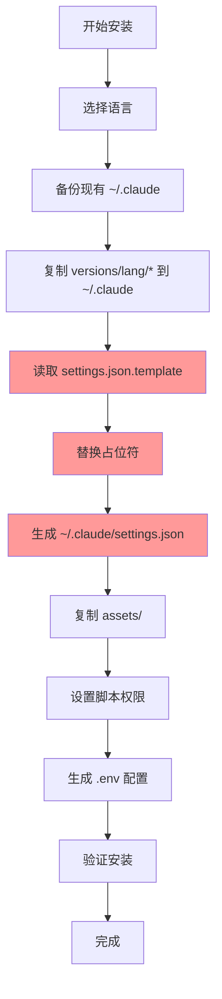

# Claude Code Cookbook 架构说明

## 项目结构概览

```
claude-code-cookbook/
├── install.sh              # 统一安装器
├── settings.json.template  # 配置模板（核心）
├── settings.json           # 安装后生成的配置（不应直接修改）
├── versions/              # 语言版本目录
│   ├── en/               # 英文版
│   ├── ja/               # 日文版
│   └── zh/               # 中文版
├── assets/               # 共享资源
├── scripts/              # 共享脚本
└── docs/                # 文档

```

## 重要概念：settings.json 的生成机制

### ⚠️ 关键理解

1. **settings.json.template 是源头**
   - 这是配置的模板文件
   - 包含占位符如 `{{CLAUDE_LANGUAGE}}`、`{{NOTIFICATION_WAITING}}` 等
   - **所有配置修改应该在这里进行**

2. **versions/ 目录不包含 settings.json**
   - 每个语言版本目录只包含该语言特定的内容
   - 不包含 settings.json（避免重复维护）

3. **安装时动态生成**
   ```bash
   install.sh 执行流程：
   1. 选择语言版本（如 zh）
   2. 复制 versions/zh/* 到 ~/.claude/
   3. 从 settings.json.template 生成 settings.json
   4. 替换占位符为语言特定值
   ```

## 配置修改指南

### ❌ 错误做法
```bash
# 直接修改根目录的 settings.json
vim settings.json  # 这个文件会被安装器覆盖
```

### ✅ 正确做法

#### 1. 修改模板（影响所有新安装）
```bash
# 编辑模板文件
vim settings.json.template

# 添加新的 Hook 配置
"UserPromptSubmit": [
  {
    "hooks": [{
      "type": "command",
      "command": "python3 $CLAUDE_PROJECT_DIR/.claude/hooks/UserPromptSubmit/append_ultrathink.py"
    }]
  }
]
```

#### 2. 修改已安装的配置（仅影响当前用户）
```bash
# 直接编辑用户目录的配置
vim ~/.claude/settings.json
```

## Hook 脚本放置位置

### 项目级 Hook（推荐）
```bash
# 每个项目可以有自己的 Hook
project-root/
└── .claude/
    └── hooks/
        └── UserPromptSubmit/
            └── append_ultrathink.py
```

### 全局 Hook
```bash
# 所有项目共享的 Hook
~/.claude/
└── hooks/
    └── UserPromptSubmit/
        └── append_ultrathink.py
```

## 安装流程详解



## 占位符系统

模板中的占位符会根据选择的语言被替换：

| 占位符 | en | ja | zh |
|--------|----|----|-----|
| `{{CLAUDE_LANGUAGE}}` | en | ja | zh |
| `{{NOTIFICATION_WAITING}}` | Waiting for confirmation | 確認待ち | 等待确认 |
| `{{NOTIFICATION_COMPLETED}}` | Task completed | タスク完了 | 任务完成 |

## 开发建议

### 添加新功能时

1. **全局功能**：修改 `settings.json.template`
2. **语言特定功能**：在 `versions/lang/` 下添加
3. **共享资源**：放在 `assets/` 或 `scripts/`
4. **Hook 脚本**：创建在项目 `.claude/hooks/` 目录

### 测试流程

```bash
# 1. 修改模板
vim settings.json.template

# 2. 测试安装
./install.sh --lang zh --target ./test-install

# 3. 验证生成的配置
cat ./test-install/settings.json

# 4. 确认无误后提交
git add settings.json.template
git commit -m "Add UserPromptSubmit hook to template"
```

## 版本管理

- `settings.json.template`：需要版本控制（核心配置）
- `settings.json`（根目录）：不应提交（安装产物）
- `versions/*/`：需要版本控制（语言特定内容）
- `~/.claude/settings.json`：用户本地文件（不提交）

## 常见问题

### Q: 为什么我修改了 settings.json 但重新安装后失效了？
A: 因为你修改的是安装产物，应该修改 `settings.json.template`

### Q: 如何为特定语言添加特殊配置？
A: 在 `install.sh` 的 `generate_settings_json()` 函数中添加语言特定的替换逻辑

### Q: Hook 脚本应该放在哪里？
A: 项目级放在 `project/.claude/hooks/`，全局级放在 `~/.claude/hooks/`

## 总结

理解 **settings.json.template → settings.json** 的生成机制是正确修改配置的关键。记住：
- 模板是源头
- 安装时生成
- 语言特定值通过占位符注入
