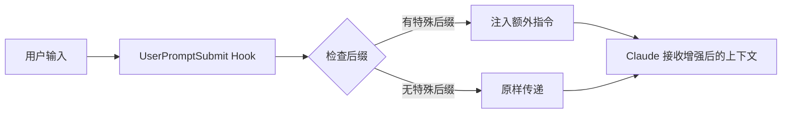

# UserPromptSubmit Hook 使用指南

## 概述

UserPromptSubmit Hook 是 Claude Code 的一个强大功能，允许在用户提交提示词时自动注入额外的上下文或指令。这个 Hook 在用户按下回车发送消息给 Claude 之前触发。

## 实现难度评估

**难度等级：⭐⭐☆☆☆（简单）**

### 为什么简单？

1. **最少代码量** - 核心逻辑只需 10-20 行代码
2. **无外部依赖** - 仅使用 Python 标准库
3. **清晰的数据流** - stdin → 处理 → stdout
4. **即时反馈** - 易于测试和调试
5. **官方支持** - Claude Code 原生支持此 Hook

## 工作原理



## 已实现功能

### 1. 智能模式切换

通过在提示词末尾添加特定后缀，自动切换 Claude 的响应模式：

| 后缀 | 模式 | 效果 |
|------|------|------|
| `-u` | Ultrathink 模式 | 深度思考，详细分析 |
| `-q` | Quick 模式 | 快速简洁回答 |
| `-d` | Debug 模式 | 显示详细推理步骤 |

### 2. 使用示例

```bash
# 普通提问
"什么是递归？"

# 启用 Ultrathink 模式
"什么是递归？ -u"
# Claude 会进行深度分析，探索多种角度

# 快速模式
"Python 的列表切片语法 -q"
# Claude 会给出简洁直接的答案

# 调试模式
"为什么这段代码报错 -d"
# Claude 会展示详细的调试步骤
```

## 技术实现细节

### 核心代码结构

```python
# 1. 读取输入
data = json.load(sys.stdin)
prompt = data.get("prompt", "")

# 2. 检查后缀
if prompt.rstrip().endswith("-u"):
    # 3. 输出额外指令（会被添加到 Claude 的上下文）
    print("额外的系统指令...")
```

### 数据流

1. **输入**：Claude Code 通过 stdin 传入 JSON
   ```json
   {
     "prompt": "用户的提示词内容"
   }
   ```

2. **处理**：Python 脚本解析并检查

3. **输出**：
   - stdout → 作为额外上下文传给 Claude
   - stderr → 调试信息（不影响结果）
   - exit code ≠ 0 → 显示错误

## 扩展可能性

### 1. 角色自动切换
```python
if prompt.endswith("-dev"):
    print("You are a senior developer...")
elif prompt.endswith("-doc"):
    print("You are a technical writer...")
```

### 2. 项目上下文注入
```python
if prompt.endswith("-ctx"):
    # 读取项目配置
    with open(".claude/project-context.md") as f:
        print(f.read())
```

### 3. 模板展开
```python
if prompt.startswith("!review"):
    print("""
    Please review this code for:
    1. Security vulnerabilities
    2. Performance issues
    3. Code style
    4. Best practices
    """)
```

### 4. 动态提示增强
```python
# 根据时间添加上下文
import datetime
if datetime.datetime.now().hour > 22:
    print("Note: It's late, keep responses concise")
```

## 配置步骤总结

1. **创建脚本**
   ```bash
   mkdir -p .claude/hooks/UserPromptSubmit
   # 创建 append_ultrathink.py
   chmod +x .claude/hooks/UserPromptSubmit/*.py
   ```

2. **注册 Hook**
   在 `settings.json` 添加：
   ```json
   {
     "hooks": {
       "UserPromptSubmit": [{
         "hooks": [{
           "type": "command",
           "command": "python3 $CLAUDE_PROJECT_DIR/.claude/hooks/UserPromptSubmit/append_ultrathink.py"
         }]
       }]
     }
   }
   ```

3. **重载配置**
   ```bash
   /reload  # 在 Claude Code 中执行
   ```

## 优势总结

1. **零侵入** - 不改变原有工作流程
2. **即时生效** - 无需重启应用
3. **灵活扩展** - 可根据需求定制
4. **项目隔离** - 每个项目可有不同配置
5. **易于维护** - 代码简单，逻辑清晰

## 故障排除

### 常见问题

1. **Hook 不触发**
   - 检查脚本权限：`chmod +x script.py`
   - 验证路径：使用绝对路径或 `$CLAUDE_PROJECT_DIR`
   - 重载配置：`/reload`

2. **没有输出**
   - 确保输出到 stdout，不是 stderr
   - 检查 JSON 解析是否成功
   - 使用测试脚本验证

3. **错误处理**
   - 捕获所有异常
   - 错误信息输出到 stderr
   - 使用非零退出码表示失败

## 最佳实践

1. **保持简单** - Hook 应该快速执行
2. **错误处理** - 总是捕获异常
3. **日志记录** - 使用 stderr 输出调试信息
4. **测试先行** - 编写测试脚本验证功能
5. **文档完善** - 记录所有自定义后缀的含义

## 总结

UserPromptSubmit Hook 是一个简单但强大的功能，通过最少的代码就能显著提升 Claude Code 的使用体验。它的实现难度低，效果立竿见影，是自定义 Claude Code 行为的绝佳起点。
