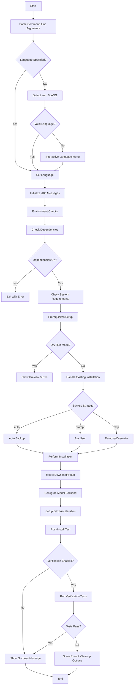

# Unified Install.sh Specification

## Overview

This document specifies the design for a unified `install.sh` script that combines the functionality of the current English and Chinese installation scripts while adding internationalization support and extensible command-line interface.

## Command-Line Interface

### Usage
```bash
./install.sh [OPTIONS]
```

### Supported Options

| Flag | Values | Default | Description |
|------|--------|---------|-------------|
| `--lang` | `en`, `zh` | Auto-detect from `$LANG` | Installation language |
| `--model` | `gemini`, `ppinfra`, `openai` | `ppinfra` | AI model backend |
| `--gpu` | `auto`, `cuda`, `metal`, `none` | `auto` | GPU acceleration |
| `--dry-run` | - | false | Preview installation without changes |
| `--source` | `local`, `remote` | `local` | Installation source |
| `--target` | `<path>` | `$HOME/.claude` | Target installation directory |
| `--backup` | `auto`, `prompt`, `skip` | `prompt` | Backup strategy for existing installation |
| `--verify` | - | true | Run post-installation verification |
| `--help` | - | - | Show help message |
| `--version` | - | - | Show version information |

### Language Detection Logic

1. **Command-line flag**: `--lang {en,zh}` takes highest precedence
2. **Environment variable**: Parse `$LANG` environment variable
   - `zh_CN*`, `zh_TW*`, `zh_HK*` → `zh`
   - `en_US*`, `en_GB*`, etc. → `en`
   - Other supported locales map accordingly
3. **Interactive menu**: If neither above provides a valid language, present user with interactive selection

## Internationalization (i18n) System

### Message Map Structure
```bash
# i18n message definitions
declare -A MESSAGES_EN MESSAGES_ZH

# English messages
MESSAGES_EN[BANNER_TITLE]="Claude Code Cookbook Installer"
MESSAGES_EN[CHECKING_DEPS]="Checking dependencies..."
MESSAGES_EN[INSTALL_SUCCESS]="Installation completed successfully!"
MESSAGES_EN[SELECT_LANG]="Please select your language:"
MESSAGES_EN[BACKUP_PROMPT]="Backup existing installation?"
MESSAGES_EN[VERIFY_INSTALL]="Verifying installation..."

# Chinese messages
MESSAGES_ZH[BANNER_TITLE]="Claude Code Cookbook 安装程序"
MESSAGES_ZH[CHECKING_DEPS]="检查依赖项..."
MESSAGES_ZH[INSTALL_SUCCESS]="安装成功完成！"
MESSAGES_ZH[SELECT_LANG]="请选择您的语言："
MESSAGES_ZH[BACKUP_PROMPT]="是否备份现有安装？"
MESSAGES_ZH[VERIFY_INSTALL]="验证安装..."
```

### Message Function
```bash
msg() {
    local key="$1"
    local lang_var="MESSAGES_${LANG^^}"
    local -n messages=$lang_var
    echo "${messages[$key]:-$key}"
}
```

### Extensibility
- New languages: Add new `MESSAGES_XX` array
- New messages: Add keys to all language arrays
- Fallback: English message if translation missing

## Installation Flow



## Detailed Component Specifications

### 1. Environment Checks
- **Operating System**: Detect macOS, Linux, Windows (WSL)
- **Shell Compatibility**: Ensure bash 4.0+ or compatible shell
- **Disk Space**: Verify minimum 500MB free space
- **Network Access**: Test connectivity for remote installations
- **Permissions**: Check write permissions for target directory

### 2. Prerequisites
- **Git**: Required for remote installations
- **curl/wget**: For downloading components
- **Node.js**: If MCP server features enabled
- **Python**: For AI model backends requiring Python
- **Claude Desktop**: Optional but recommended

### 3. Model Download/Setup
Based on `--model` flag:
- **PPINFRA**: Configure OpenAI-compatible API with qwen/qwen3-235b-a22b-thinking-2507
- **GEMINI**: Setup Google Gemini API integration
- **OpenAI**: Configure OpenAI API endpoints
- **Local Models**: Download and setup local model files

### 4. Post-Install Test
- **Configuration Validation**: Verify all config files are valid
- **API Connectivity**: Test model backend connections
- **Command Execution**: Run basic cookbook commands
- **Integration Test**: Test Claude Desktop integration if available

## Code Architecture

### File Structure
```
install.sh                 # Main installation script
├── functions/
│   ├── args_parser.sh     # Command-line argument parsing
│   ├── i18n.sh           # Internationalization system
│   ├── env_check.sh      # Environment validation
│   ├── prerequisites.sh  # Dependency installation
│   ├── installer.sh      # Core installation logic
│   └── verifier.sh       # Post-install verification
└── config/
    ├── models.conf       # Model configuration templates
    └── defaults.conf     # Default settings
```

### Error Handling
- **Exit Codes**: Standard exit codes for different error types
- **Logging**: Detailed logging with timestamps
- **Rollback**: Automatic rollback on critical failures
- **User Feedback**: Clear error messages with suggested solutions

### Configuration Management
- **Settings File**: `~/.claude/install.conf` for persistent settings
- **Environment Variables**: Support for CI/CD environments
- **Config Validation**: Schema validation for configuration files

## Security Considerations

### Input Validation
- Sanitize all user inputs
- Validate file paths to prevent directory traversal
- Check URL schemes for remote downloads

### File Operations
- Use temporary directories with proper cleanup
- Verify checksums for downloaded files
- Set appropriate file permissions

### Network Security
- Use HTTPS for all downloads
- Verify SSL certificates
- Timeout settings for network operations

## Testing Strategy

### Unit Tests
- Individual function testing
- Mock external dependencies
- Edge case validation

### Integration Tests
- End-to-end installation flow
- Different operating system environments
- Various configuration combinations

### User Acceptance Tests
- Interactive mode testing
- Language switching verification
- Error recovery scenarios

## Backwards Compatibility

### Migration Strategy
- Auto-detect existing installations
- Migrate configuration files
- Preserve user customizations

### Legacy Support
- Support for existing directory structures
- Graceful handling of old configuration formats
- Migration warnings and guidance

## Performance Optimizations

### Parallel Operations
- Concurrent dependency checks
- Parallel file downloads
- Background verification tasks

### Caching
- Cache downloaded models
- Reuse dependency checks
- Store validation results

### Progress Indicators
- Real-time progress bars
- Step completion feedback
- Time estimation for long operations

## Maintenance and Updates

### Version Management
- Semantic versioning for installer
- Compatibility matrix with cookbook versions
- Update notifications

### Logging and Diagnostics
- Structured logging format
- Debug mode for troubleshooting
- Anonymous usage statistics (opt-in)

## Example Usage Scenarios

### Scenario 1: Default Installation
```bash
./install.sh
# Auto-detects language, uses defaults, interactive prompts
```

### Scenario 2: Automated CI/CD
```bash
./install.sh --lang en --model ppinfra --gpu cuda --dry-run --target /opt/claude
# Non-interactive, specific configuration, preview mode
```

### Scenario 3: Chinese User with Backup
```bash
./install.sh --lang zh --backup auto --verify
# Chinese interface, automatic backup, full verification
```

### Scenario 4: Developer Mode
```bash
./install.sh --source local --model gemini --gpu none --target ./test-install
# Local development, alternative model, custom target
```

This specification provides a comprehensive foundation for implementing a unified, internationalized, and extensible installation system for the Claude Code Cookbook project.
