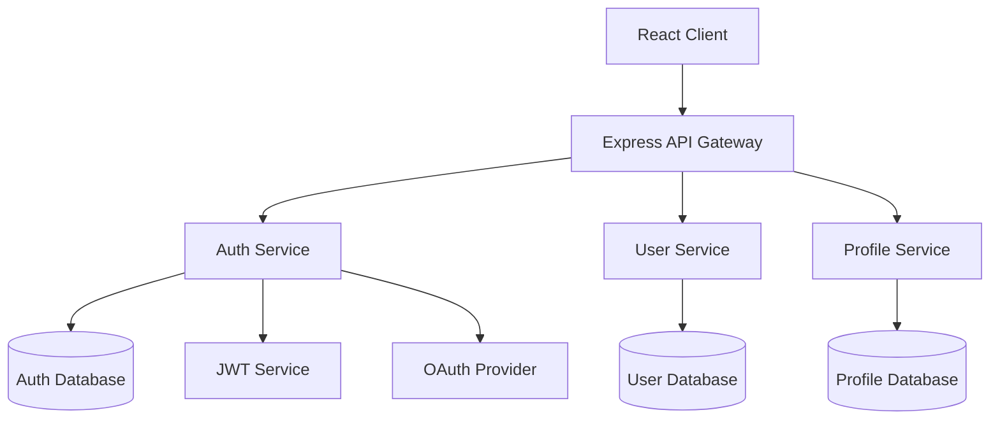

## Spec

**"Give structure before writing code"** - Full compliance with Kiro spec-driven development

Unlike traditional code generation tools, this realizes Kiro's specification-driven development focused on giving structure to development chaos. From minimal requirement inputs, it gradually expands to product manager-level detailed specifications and implementable designs, ensuring consistent quality **from prototype to production environment**.

### Usage

```bash
# Request Claude Spec Mode (minimal requirement input)
"Create a spec for [feature description]"

# Kiro-style gradual expansion:
# 1. Simple requirements → automatic detailed user story generation
# 2. Structured requirement descriptions using EARS notation
# 3. Specification refinement through staged dialogue
# 4. Generation of 3 independent files:
#   - requirements.md: requirement definitions using EARS notation
#   - design.md: design including Mermaid diagrams and TypeScript interfaces
#   - tasks.md: implementation plan with automatic best practices application
```

### Proven Results (Kiro Track Record)

**Secure File Sharing App in 2 Days**
```bash
"Create a spec for file sharing system (with encryption support)"
→ Production-level encrypted file sharing application completed in 2 days
→ Automatic security best practices application
→ No additional prompts required
```

**Game Development in One Night (Inexperienced Developer)**
```bash
"Create a spec for 2D puzzle game"
→ Open source developer with no game development experience
→ Game creation completed in one night
→ Kiro handled implementation logic, developer focused on creativity
```

**Prototype to Production Over Weekend**
```bash
"Create a spec for EC site product management system"
→ From concept to working prototype in one weekend
→ Consistent quality from prototype to production environment
→ Structured approach through spec-driven development
```

### Basic Examples

```bash
# New feature spec creation (minimal input)
"Product review system - star rating functionality - comment posting - image upload"

# System feature spec creation
"User authentication - OAuth support - multi-factor authentication"

# API feature spec creation
"Payment system API - Stripe integration - security focused"
```

### Integration with Claude

```bash
# Complex feature spec
"Create a spec for chat functionality. Include WebSocket, real-time notifications, and history management"

# Database integration feature spec
"Create a spec for EC site inventory management functionality. Include product addition, stock updates, and alert functions"

# Frontend feature spec
"Create a spec for React dashboard. Include graph display, filtering, and export functionality"

# Backend feature spec
"Create a spec for RESTful API. Include authentication, validation, and logging"
```

### Spec Mode Features

**Staged Interactive Workflow**
- Complete recreation of Kiro's core value of staged discussion
- Collaborative specification refinement with user at each phase
- File generation through question resolution, option discussion, and approval processes

**3-Stage Interactive Expansion**
- **Phase 1**: Requirements Discovery → Discussion → Approval → `requirements.md` generation
- **Phase 2**: Design Exploration → Discussion → Approval → `design.md` generation
- **Phase 3**: Implementation Planning → Discussion → Approval → `tasks.md` generation

**Dynamic Specification Development**
- Resolve requirement ambiguities through dialogue
- Present and discuss technical options
- Explain trade-offs and confirm decisions

### Detailed Examples

```bash
# Complex system functionality
"Create a spec for online payment system. Include Stripe integration, security, and error handling"

# Frontend functionality
"Create a spec for React components. Include state management, property design, and testing"

# Backend functionality
"Create a spec for GraphQL API. Include schema design, resolvers, and authentication"

# DevOps functionality
"Create a spec for CI/CD pipeline. Include test automation, deployment, and monitoring"
```

### Staged Interactive Workflow (Phase by Phase)

#### Phase 1: Requirements Discovery & Discussion

**1. Automatic Expansion from Minimal Input (Kiro-style)**
```
User: "User management system - login functionality - profile editing - administrator privileges"

Claude: "Generating detailed user stories from requirements.
Is this understanding correct?

Auto-generated user stories:
- User registration/authentication functionality (OAuth support)
- Profile management functionality (avatar, settings)
- Permission management functionality (RBAC)
- Password reset functionality
- Security audit logs

I've supplemented unspecified details. Are there any other necessary features?"
```

**2. Structured Requirement Description Using EARS Notation**
```
Claude: "Structuring requirements using Kiro EARS notation:

Requirements definition using EARS notation:

WHEN a user attempts to login
GIVEN correct email address and password are entered
THEN the system shall verify authentication
AND redirect to dashboard upon success

WHILE a user is on the profile editing screen
THE SYSTEM SHALL execute real-time validation
AND display change previews

WHERE administrator privileges are required for functionality
IS access is attempted
THE SYSTEM SHALL verify permission levels
AND deny access if insufficient"
```

**3. Automatic Completion of Edge Cases and Security Requirements**
```
Claude: "Based on Kiro best practices, I've also considered the following cases:

Security requirements (auto-completed):
- Brute force attack countermeasures
- Session management and timeouts
- CSRF protection and XSS countermeasures
- Password strength requirements

Edge cases (auto-detected):
- Concurrent login limitations
- Account lock functionality
- Data migration consistency assurance
- Load balancing for high volume requests

Are these requirements appropriate?"
```

**5. Phase 1 Completion and Approval**
```
Claude: "Requirements Phase completed.
Generate requirements.md file?"
→ "Proceed" → requirements.md generation
```

#### Phase 2: Design Exploration & Discussion

**1. Codebase Analysis + Automatic Design Proposal (Kiro-style)**
```
Claude: "Analyzing existing codebase and proposing optimal architecture:

Codebase analysis results:
- Authentication: JWT + Express.js (v4.18.x)
- Database: PostgreSQL (v14+)
- Frontend: React + TypeScript (v18+)
- Existing patterns: Repository pattern, Service layer separation

Kiro recommended architecture:
- Clean Architecture compliance
- Domain-Driven Design elements
- Partial CQRS pattern application
- Automated security best practices

Proceed with this design?"
```

**2. Visual Design with Mermaid Diagrams**
```
Claude: "System design auto-generated with Mermaid diagrams:

Auto-generated architecture diagram:


Should I also generate data flow diagrams?"
```

**3. Automatic TypeScript Interface Generation**
```
Claude: "Auto-generating TypeScript interfaces based on design:

Auto-generated TypeScript interfaces:
```typescript
// Domain entities
interface User {
  readonly id: UserId;
  readonly email: Email;
  readonly profile: UserProfile;
  readonly auth: AuthSettings;
  readonly permissions: Permission[];
  readonly createdAt: Date;
  readonly updatedAt: Date;
}

interface UserProfile {
  readonly displayName: string;
  readonly avatar: AvatarUrl;
  readonly preferences: UserPreferences;
}

interface AuthSettings {
  readonly passwordHash: PasswordHash;
  readonly mfaEnabled: boolean;
  readonly lastLoginAt: Date;
  readonly failedAttempts: number;
}

// Use cases
interface UserRepository {
  findById(id: UserId): Promise<User | null>;
  findByEmail(email: Email): Promise<User | null>;
  save(user: User): Promise<void>;
}

interface AuthenticationService {
  authenticate(credentials: LoginCredentials): Promise<AuthResult>;
  refreshToken(token: RefreshToken): Promise<AccessToken>;
}
```

Proceed with this interface design?"
```

**4. Phase 2 Completion and Approval**
```
Claude: "Design Phase completed.
Generate design.md file?"
→ "Proceed" → design.md generation
```

#### Phase 3: Implementation Planning & Discussion

**1. Automatic Best Practices Application (Kiro-style)**
```
Claude: "Generated implementation plan with Kiro best practices auto-applied:

Auto-generated implementation strategy:

1. Security-first development
   - Automatic OWASP Top 10 countermeasures integration
   - Automatic encryption/hashing implementation
   - Automatic security test generation

2. Clean Architecture enforcement
   - Automatic layer separation implementation
   - Automatic dependency inversion application
   - Testable design enforcement

3. Performance optimization
   - Automatic cache strategy implementation
   - Database optimization
   - Asynchronous processing utilization

Proceed with this approach?"
```

**2. Automatic Quality Checkpoint Setup**
```
Claude: "Auto-configured quality checkpoints for each implementation stage:

Automatic quality assurance process:

Phase 3a: Backend implementation
- [ ] Security scan (SAST/DAST)
- [ ] API specification test (OpenAPI compliance)
- [ ] Performance test (load/response)
- [ ] Vulnerability scan (dependencies/CVE)

Phase 3b: Frontend implementation
- [ ] Accessibility test (WCAG 2.1 AA)
- [ ] Browser compatibility test
- [ ] Responsive design verification
- [ ] Security header confirmation

Phase 3c: Integration & deployment
- [ ] E2E test suite
- [ ] CI/CD pipeline setup
- [ ] Monitoring/logging setup
- [ ] Production environment security audit

All will be executed automatically. Any additional quality standards?"
```

**3. Automatic Dependency and Risk Mitigation Analysis**
```
Claude: "Auto-analyzed implementation order and risk mitigation strategies:

Optimized implementation order:

Week 1: Infrastructure & security foundation
- Database design & schema creation
- Authentication foundation (JWT + session management)
- Security middleware implementation
- Basic API endpoints

Week 2: Core functionality implementation
- User management functionality
- Profile management functionality
- Permission management system
- Validation & error handling

Week 3: Advanced features & optimization
- Multi-factor authentication implementation
- Audit log functionality
- Performance optimization
- Frontend integration

Auto-detected risk mitigation strategies:
- Multi-factor authentication: staged introduction (SMS → app authentication)
- Session management: Redis cluster configuration
- High volume access: rate limiting + CDN utilization
- Data consistency: enhanced transaction management

Any issues with this plan?"
```

**4. Phase 3 Completion and Approval**
```
Claude: "Implementation Planning Phase completed.
Generate tasks.md file?"
→ "Proceed" → tasks.md generation
```

### Kiro-Specific Features

**EARS Notation (Easy Approach to Requirements Syntax)**
```markdown
# Kiro standard EARS notation patterns
WHEN [situation/trigger]
GIVEN [prerequisites]
THEN [system behavior]
AND [additional behavior]

WHILE [state/process]
THE SYSTEM SHALL [required behavior]
AND [related behavior]

WHERE [function/component]
IS [condition/state]
THE SYSTEM SHALL [response behavior]
```

**Auto-Generation Features**
- **Mermaid Diagrams**: Automatic generation of architecture and data flow diagrams
- **TypeScript Interfaces**: Automatic type definition creation based on design
- **Best Practices**: Automatic integration of security and performance countermeasures
- **Quality Checkpoints**: Automatic setup of staged quality standards

**Hooks Integration**
- Automatic quality checks on file save
- Automatic code standard application
- Automatic security scan execution
- Automatic OWASP Top 10 countermeasure verification

**Prototype → Production Quality Assurance**
- Consistent design through structured approach
- Security-first development enforcement
- Automatic scalable architecture application
- Built-in continuous quality management

### Notes

**Application Scope**
- Spec Mode optimized for feature implementation
- Use usual implementation format for simple fixes or small-scale changes
- Recommended for new feature development or complex feature modifications

**Quality Assurance**
- Clear completion criteria for each stage
- Design review before implementation
- Comprehensive quality standards including testing and accessibility

**Execution Notes**
- Resolve requirement ambiguities before design stage
- Generate implementation tasks after design completion
- Emphasize approval process at each stage

### Trigger Phrases and Control

#### Staged Workflow Control

**Start Triggers**
- "Create a spec for [feature name]"
- "Want to develop spec-driven [feature name]"
- "Design [feature name] from specification"

**Phase Progress Control**
- **"Proceed"**: Complete current phase, generate file, move to next phase
- **"Modify"**: Adjust and improve content within current phase
- **"Start over"**: Restart current phase from beginning
- **"Explain in detail"**: Present more detailed explanations or options
- **"Skip"**: Skip current phase and move to next (not recommended)

**File Generation Timing**
```
Phase 1 completion → "Proceed" → requirements.md generation
Phase 2 completion → "Proceed" → design.md generation
Phase 3 completion → "Proceed" → tasks.md generation
```

### Execution Example (Staged Flow)

```bash
# Usage example
User: "Create a spec for user management system"

# Phase 1: Requirements Discovery
Claude: [Start requirement confirmation and discussion]
User: [Response/discussion/modifications]
Claude: "Requirements Phase completed. Proceed?"
User: "Proceed" → requirements.md generation

# Phase 2: Design Exploration
Claude: [Start design proposal and discussion]
User: [Technology selection/architecture discussion]
Claude: "Design Phase completed. Proceed?"
User: "Proceed" → design.md generation

# Phase 3: Implementation Planning
Claude: [Start implementation plan discussion]
User: [Priority/risk/effort discussion]
Claude: "Implementation Phase completed. Proceed?"
User: "Proceed" → tasks.md generation

# Completion
Claude: "Spec-driven development preparation completed. Implementation can begin."
```

### Differences from /plan

| Feature | /plan | /spec |
|---------|-------|--------|
| Target | General implementation planning | Functional specification-driven development |
| Output Format | Single planning document | 3 independent files (requirements.md, design.md, tasks.md) |
| Requirements Definition | Basic requirement organization | Detailed acceptance criteria using EARS notation |
| Design | Technology selection focused | Codebase analysis based |
| Implementation | General task breakdown | Sequence considering dependencies |
| Quality Assurance | Basic test strategy | Comprehensive quality requirements (testing, accessibility, performance) |
| Synchronization | Static planning | Dynamic spec updates |

### Recommended Use Cases

**Spec Usage Recommended**
- New feature development
- Complex feature modifications
- API design
- Database design
- UI/UX implementation

**Plan Usage Recommended**
- Overall system design
- Infrastructure construction
- Refactoring
- Technology selection
- Architecture changes
